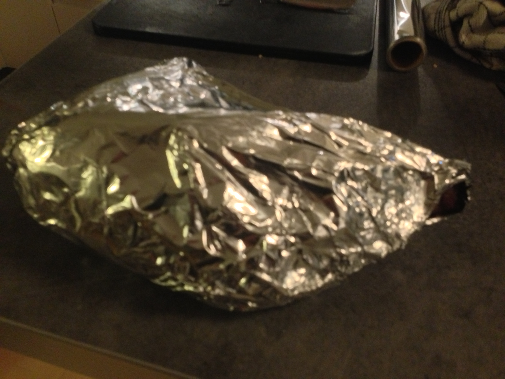

# Beef Cuvette Oven Roast w/ AwesomeSauce

> How to cook the perfect oven roast with a bonus side order of tasty sauce. Serves 4-8 people depending on meat
> quantity. Or two-three filthy food pigs with low self control.

## Preparation time

Depends on weight of roast after trimming: 2.5 - 3.0 hours

## Ingredient list:

* 1pcs Beef Cuvette/Culotte
* Salt, coarse
* Optional: garlic
* Corn starch or wheat flour

## Equipmunk list:

* Cutting board; preferrably with juice catcher
* A __sharp__ knife. The duller the knife, the more likely you will cut yourself while trimming
* Scale for weighing
* Meat thermometer
* Timer
* Oven pan. I like non-stick ones for roasts.
* 1pcs dog or garbage can

Steps to success:

### Preparation

You've got your meat and your knife. Start by turning the roast upside-down so you can trim off the fat and sinew.
To trim the sinew, place the knife so all of the blade touches the meat right where the fat/sinew connects to the
meat. Start a small cut, lift up the sinew/fat part and slowly cut along the meat. Don't be afraid to lose a little
meat in the process.

Throw the trimmings in the dog or the garbage can, depending on which you have available.

> Optional step: poke-n-garlic
> If you like garlic and aren't going to a kissing party after eating, I recommend garlic poking. Take a slim,
> pointy knife and from the bottom side of the roast, poke holes about 2.5 centimeters long and 4 centimeters deep,
> then insert cloves of garlic. If the cloves are too fat to fit, cut them length-wise to make two slivers of clove.

Turn the roast right side up, then rub the fat layer with coarse cooking salt. Don't be afraid to use it!

Now weigh the trimmed roast - you'll need to know the exact weight to determine how long your cooking intervals
must be to give you a rosy red roast from core to rim. This particular roast was 1.65 kgs.

Put the roast in the oven pan and pick up your calculator for a bit of basic math.

> Note: many oven roast recipes call for adding water to the oven pan while cooking the roast. While that certainly
> is a good choice for some roasts, it does not help in this case. Don't add water to the oven pan - the evaporation
> will cool the bottom of the oven pan and combined with the fairly low oven temperature, you risk an unevenly
> cooked roast. And that's just no fun.

### Calculating cooking intervals

To know how long to cook your roast, use this small formula (feel free to round result off to full minutes):

  10 + ((_w_ / 1.5) * 5)

Where _w_ is the weight of the roast in kilos with decimals. Example: this roast weighs 1.65kg when trimmed, which
means each interval shoul be: 10 + ((1.65 / 1.5 = 1.1) * 5 = 5.5) = 15.5 minutes. Let's round that down to 15 to
afford a bit of moisture loss.

### Cooking in intervals

Knowing your intervall you can now start cooking the roast. In a pre-heated oven at 160 degrees C if ventilated,
180 degrees C if traditional, cook the roast in intervals of the duration you calculated. After cooking for one
interval, take the roast out and let it sit (uncovered) for another interval duration, then put it back. The final
interval cooks the roast until the desired core temperature is reached. The entire process for this example roast
looks like this:

* Cooking 15 minutes
* Resting 15 minutes
* Cooking 15 minutes
* Resting 15 minutes
* Cooking 15-30 minutes depending on weight.

Before putting the roast in the oven for the final interval, insert a meat thermometer - with beef cuvettes and
culottes only a few degress separates rare from well done and it's almost impossible to time a somewhat irregular
piece of meat that a cuvette cut is. Insert the meat thermometer so the point ends up as close as possible to the
center of the thickest part of the roast. Make sure you can read it from outside the oven ;)

You should aim for:

* 60 degrees gives very rare 
* 62 degrees gives you rare
* 63 degress for medium-rare
* 64 degress for medium
* 66+ degrees for well done

I would advise against cooking to anything above medium rare with a cut of meat such as this. The interval approach
ensures the roast is evenly cooked all way through - which means you won't have a problem of a too rare center even
when targeting an overall rare meat temperare.

The use of a meat thermometer is almost a must. It is very hard to hit the perfect temperature without it - just by
gauging the size of the roast and the thickness of the thickest part.

Below, the stages of cooking:

And voila - ultimately juicy roast:

### Resting

When the desired temperature is reached *immediately* take the roast out, remove the thermometer, wrap the roast in
3-4 layers of tin foil and follow those layers with 2-3 kitchen towels. Pour the cooking juice from the oven pan
into a sauce pan and use for the AwesomeSauce. Rinse the oven pan and put the wrapped roast there - leave it
someplace hot (by this time you will find yourself in a pretty hot kitchen I'm sure!) for *exactly* 45 minutes,
then cut it. When wrapping the roast you can leave a tiny open space so you can pour the excess juices out into the
sauce pan around the 30 minute mark and again right before cutting - but take my advise and don't make this hole
anywhere near the bottom side the roast will be resting on, or you'll lose your juice.

This 45 minute resting period is not optional. During this time the meat core temperature will drop a few degrees
but you'd be surprised how little it actually drops (if you wrap the roast properly).

By the way, 45 minutes is almost exactly how long it takes to cook Hasselback potatoes. Which as luck would have it,
requires an oven pre-heated to 180 degress for ~45 minutes (with optional high-heat/grill finish).

### Bonus: AwesomeSauce

When making an oven roast, making an AwesomeSauce is excessively easy. Take the cooking juice you saved up while
cooking the roast, add about the same volume of milk (or use water here and add some cream later if you have cream),
put it all in a sauce pan and start heating it up. When the sauce is close to boiling, thicken it with a mixture of
corn starch and water which you whipped up separately. If you don't have corn starch, regular wheat flour can be
used in a pinch. Pour the starch/flour mixture slowly into the sauce until it reaches the consistency you want.

Adjust the taste using salt and pepper (some would also go as far as to add MSG-based spices) and if you wish and
if you have it, add a tiny bit of brown food coloring. Whisp for a while longer while you keep the sauce at medium
heat (don't boil it!) then take it off the burner and let it sit (but not too long!): then serve.

### Cutting

To properly cut a cuvette roast, start from the thin end and cut slices about 0.5cm thick (yes, I like the slices
a bit thick) and stop when you're half-way through the roast, then turn it 45 degress counter clockwise (if you're
right handed) and continue cutting. If you don't cut it all at once, you should re-wrap it between cutting slices.

You should serve the first slices you cut from either angle, to the person or persons who like their meat closer
to medium and prefer less fat (as luck would have it, those two preferences often go together).

Bon Appetit!

/NamelessCook
